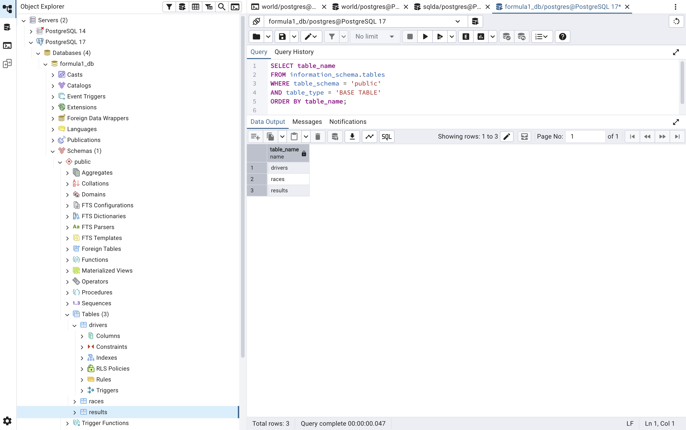
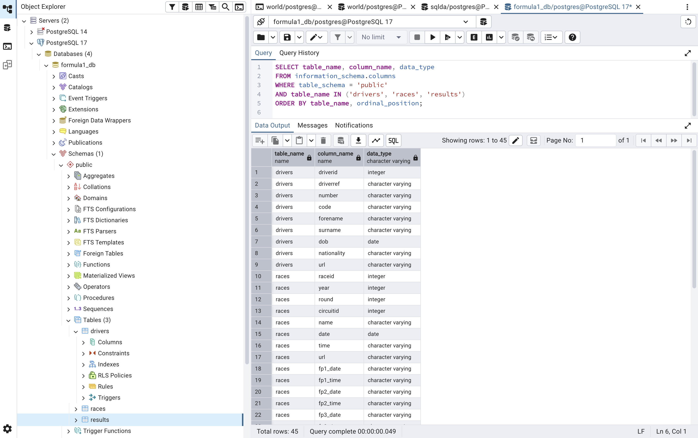
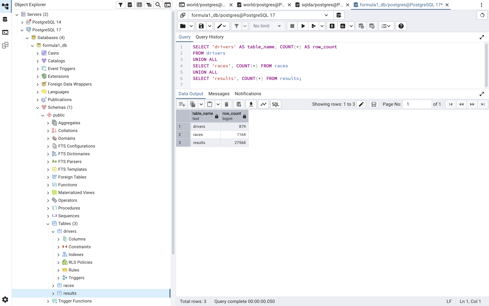
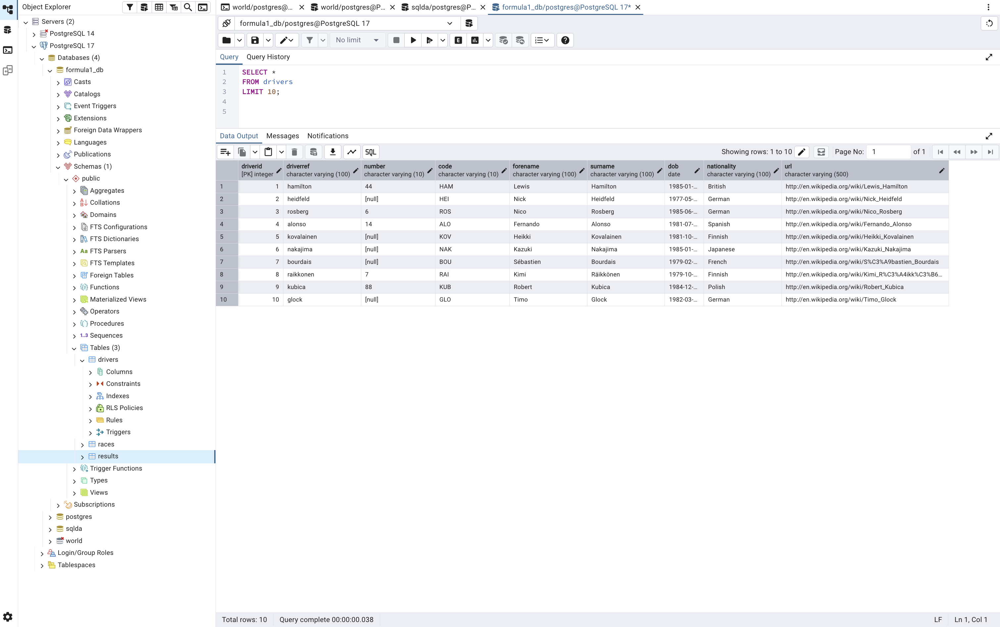
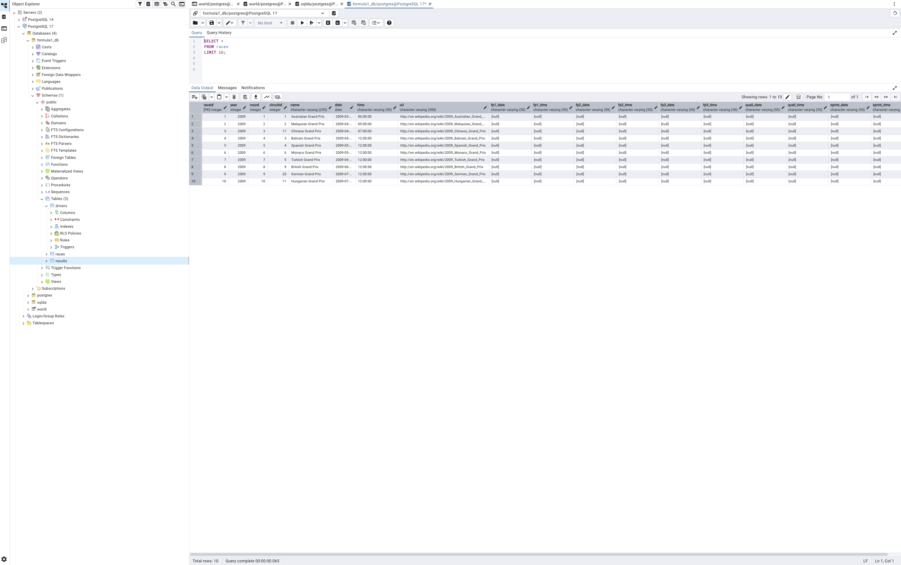
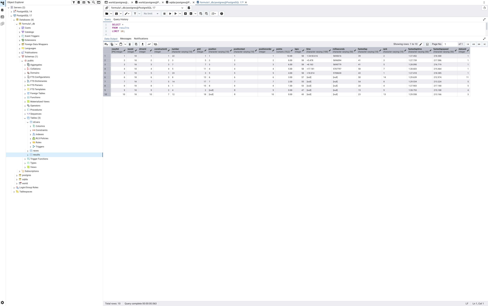
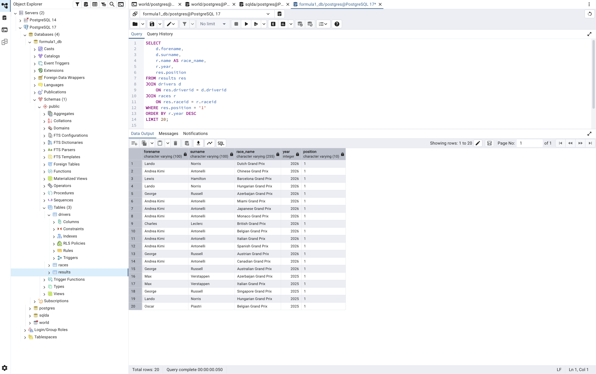
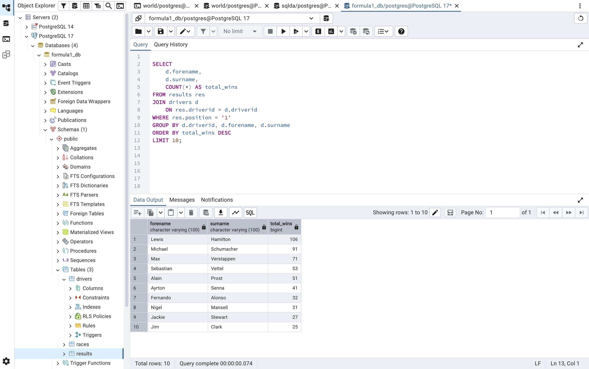

# Module 7 - Final Project: Formula 1 Database

**Name:** Brandon Smith
**Course:** Database for Analytics
**Operating System:** macOS
**Tools:** PostgreSQL and pgAdmin 4

## 1. Overview

For my final project, I downloaded Formula 1 racing data from Kaggle and imported it into PostgreSQL. I used pgAdmin 4 to create tables, check the data, and run SQL queries.

## 2. Data Source

I used the Formula 1 World Championship dataset from Kaggle.

Dataset: https://www.kaggle.com/datasets/atharvranjan/formula-1-world-championship-1950-present

I downloaded three CSV files:

- drivers.csv
- races.csv
- results.csv

After importing the files, my database contained:

- Drivers: 879 rows
- Races: 1,164 rows
- Results: 27,568 rows

## 3. Creating the Database

I created a PostgreSQL database named `formula1_db`.

Inside the database, I created three tables: `drivers`, `races`, and `results`.

The drivers table contains information about Formula 1 drivers. The races table contains information about each race. The results table contains finishing positions, points, and other race information.

The results table connects the other two tables using `driverid` and `raceid`.

I checked the tables using this SQL query:

```sql
SELECT table_name
FROM information_schema.tables
WHERE table_schema = 'public'
AND table_type = 'BASE TABLE'
ORDER BY table_name;
```



I also checked the column names and data types.

```sql
SELECT table_name, column_name, data_type
FROM information_schema.columns
WHERE table_schema = 'public'
AND table_name IN ('drivers', 'races', 'results')
ORDER BY table_name, ordinal_position;
```



## 4. Importing the Data

I downloaded the CSV files from Kaggle and used pgAdmin 4 to import them into PostgreSQL.

I matched the columns with the CSV files and checked the data after importing it.

The hardest part was finding a dataset that met the project requirements. I also had to make sure the columns matched the files and that missing values were handled correctly.

## 5. Checking the Data

After importing the files, I used SQL to make sure the data was loaded.

First, I counted the rows in each table.

```sql
SELECT 'drivers' AS table_name, COUNT(*) AS row_count
FROM drivers
UNION ALL
SELECT 'races', COUNT(*) FROM races
UNION ALL
SELECT 'results', COUNT(*) FROM results;
```



Next, I checked the first 10 rows in each table.

### Drivers

```sql
SELECT *
FROM drivers
LIMIT 10;
```



### Races

```sql
SELECT *
FROM races
LIMIT 10;
```



### Results

```sql
SELECT *
FROM results
LIMIT 10;
```



These queries helped me confirm that the tables contained data and that the values were appearing correctly.

## 6. SQL Analysis

### Query 1: Race Winners

I used JOIN to connect the three tables and display race winners, their names, the race, and the year.

```sql
SELECT
    d.forename,
    d.surname,
    r.name AS race_name,
    r.year,
    res.position
FROM results res
JOIN drivers d
    ON res.driverid = d.driverid
JOIN races r
    ON res.raceid = r.raceid
WHERE res.position = '1'
ORDER BY r.year DESC
LIMIT 20;
```



### Query 2: Drivers With the Most Wins

I used GROUP BY and COUNT to find the drivers with the most race wins.

```sql
SELECT
    d.forename,
    d.surname,
    COUNT(*) AS total_wins
FROM results res
JOIN drivers d
    ON res.driverid = d.driverid
WHERE res.position = '1'
GROUP BY d.driverid, d.forename, d.surname
ORDER BY total_wins DESC
LIMIT 10;
```



## 7. Data Dictionary

The Formula 1 database contains three tables: drivers, races, and results. The tables have 45 columns in total. Below are the column names, data types, and descriptions.

### Drivers Table

| Column | Data Type | Description |
|---|---|---|
| driverid | integer | Unique driver ID |
| driverref | varchar | Driver reference name |
| number | varchar | Driver's racing number |
| code | varchar | Driver's abbreviation |
| forename | varchar | Driver's first name |
| surname | varchar | Driver's last name |
| dob | date | Driver's date of birth |
| nationality | varchar | Driver's nationality |
| url | varchar | Link to driver information |

### Races Table

| Column | Data Type | Description |
|---|---|---|
| raceid | integer | Unique race ID |
| year | integer | Season year |
| round | integer | Race number in the season |
| circuitid | integer | Circuit ID |
| name | varchar | Race name |
| date | date | Race date |
| time | varchar | Race start time |
| url | varchar | Link to race information |
| fp1_date | varchar | First practice date |
| fp1_time | varchar | First practice time |
| fp2_date | varchar | Second practice date |
| fp2_time | varchar | Second practice time |
| fp3_date | varchar | Third practice date |
| fp3_time | varchar | Third practice time |
| quali_date | varchar | Qualifying date |
| quali_time | varchar | Qualifying time |
| sprint_date | varchar | Sprint race date |
| sprint_time | varchar | Sprint race time |

### Results Table

| Column | Data Type | Description |
|---|---|---|
| resultid | integer | Unique result ID |
| raceid | integer | Race associated with the result |
| driverid | integer | Driver associated with the result |
| constructorid | integer | Team ID |
| number | varchar | Driver's racing number |
| grid | integer | Starting position |
| position | varchar | Final finishing position |
| positiontext | varchar | Finishing position as text |
| positionorder | integer | Numeric finishing order |
| points | numeric | Championship points earned |
| laps | integer | Number of laps completed |
| time | varchar | Race time or time difference |
| milliseconds | varchar | Race time in milliseconds |
| fastestlap | varchar | Lap number of fastest lap |
| rank | varchar | Fastest lap ranking |
| fastestlaptime | varchar | Fastest lap time |
| fastestlapspeed | varchar | Fastest lap speed |
| statusid | integer | Race completion status ID |

## 8. Results and Conclusion

My results showed that Lewis Hamilton had 106 wins, Michael Schumacher had 91 wins, and Max Verstappen had 71 wins in the imported data.

This project helped me understand how to create a database, import CSV files, check data using SQL, and connect tables using JOIN. I also learned how to use GROUP BY to summarize results.

## 9. Challenges and Solutions

One challenge was importing the CSV files and making sure the data was correct. I checked the import settings and used SQL queries to make sure everything loaded properly.

## Reference

Formula 1 World Championship - Kaggle

https://www.kaggle.com/datasets/atharvranjan/formula-1-world-championship-1950-present
